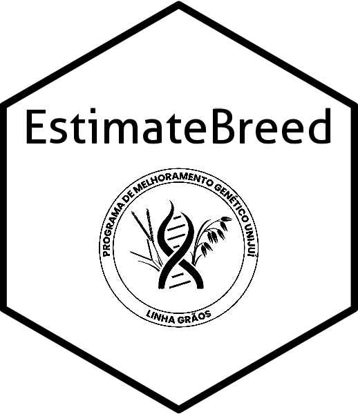

<!-- README.md is generated from README.Rmd. Please edit that file -->

# EstimateBreed 

<!-- badges: start -->

<!-- badges: end -->

EstimateBreed is an R package designed to perform analyses and estimate
environmental covariates and genetic parameters related to selection
strategies and the development of superior genotypes. The package offers
two main functionalities:

-   **Prediction models** for environmental covariates and processes.
-   **Estimation of genetic parameters** and selection strategies for
    developing superior genotypes.

## Installation

You can install the development version of EstimateBreed from
[GitHub](https://github.com/) with:

    # install.packages("pak")
    pak::pak("willyanjnr/EstimateBreed")

### Example

Obtain the genetic selection index for resilience (ISGR) for selecting
genotypes for environmental stressors, as described by [Bandeira et
al. (2024)](https://www.cropj.com/Carvalho_18_12_2024_825_830.pdf).

    library(EstimateBreed)

    #Obtain environmental deviations
    data("desvamb")
    with(desvamb,desv_clim(ENV,TMED,PREC))
    # A tibble: 3 × 5
    #  ENV   STMED TMEDR SPREC PRECIR
    #  <chr> <dbl> <dbl> <dbl>  <dbl>
    # 1 E1     2.65  24.8  5.46   339.
    # 2 E2     3.65  23.8  5.27   344.
    # 3 E3     2.81  24.5  5.47   362.

    #Get the ISGR
    data("genot")
    with(genot, isgr(GEN, ENV, NG, MG, CICLO))
    #    Gen Env      ISGR
    # 26 L454  E1  6.489941
    # 22 L455  E1  7.084315
    # 19 L541  E1  7.653157
    # 18 L367  E1  7.862185
    # 16 L380  E1  8.329434
    # 12 L393  E1  9.638909
    # 10 L439  E1 10.552056
    # 28 L298  E3 12.209433
    # 30 L358  E2 23.347984
    # 29 L346  E2 23.793351
    # 27 L195  E2 24.719927
    # 25 L179  E2 25.747317
    # 24 L359  E2 26.300686
    # 23 L345  E2 26.886419
    # 1  L445  E1 27.255375
    # 21 L185  E2 28.211433
    # 20 L310  E2 28.942165
    # 17 L178  E2 31.418785
    # 15 L261  E2 33.424611
    # 14 L269  E2 34.605133
    # 13 L209  E2 35.959423
    # 11 L263  E2 39.127798
    # 9  L201  E2 43.145922
    # 8  L299  E2 45.686042
    # 7  L152  E2 48.926278
    # 6   L26  E2 52.988109
    # 5  L166  E2 57.596139
    # 4  L155  E2 64.251152
    # 3  L277  E2 74.756384
    # 2  L162  E2 86.543916

Predict ∆T to determine the ideal times to apply agricultural
pesticides.

    library(EstimateBreed)

    # Forecasting application conditions
    tdelta(-53.696944444444,-28.063888888889,type=1,days=10)

    # Retrospective analysis of application conditions
    tdelta(-53.6969,-28.0638,type=2,days=10,dates=c("2023-01-01","2023-05-01"))

Estimation of soybean plastochron using average air temperature and
number of nodes

    library(EstimateBreed)
    data("pheno")

    with(pheno, plast(GEN,TMED,EST,NN,habit="ind",plot=TRUE))

## Documentation

Complete documentation can be found when using the package within R.

## Citing

When citing this package, please use,

    library(EstimateBreed)
    citation("EstimateBreed")

    To cite package ‘EstimateBreed’ in publications use:

      Willyan Jr. A. Bandeira, Ivan R. Carvalho, Murilo V. Loro, Leonardo
      C. Pradebon, José A. G. da Silva (2025). _EstimateBreed: Estimation
      of Environmental Variables and Genetic Parameters_. R package
      version 0.1.0, <https://github.com/willyanjnr/EstimateBreed>.

    A BibTeX entry for LaTeX users is

      @Manual{,
        title = {EstimateBreed: Estimation of Environmental Variables and Genetic Parameters},
        author = {{Willyan Jr. A. Bandeira} and {Ivan R. Carvalho} and {Murilo V. Loro} and {Leonardo C. Pradebon} and {José A. G. da Silva}},
        year = {2025},
        note = {R package version 0.1.0},
        url = {https://github.com/willyanjnr/EstimateBreed},
      }

## Getting Help

-   If you find any errors, please make a report with the commands used
    so that we can repeat, check and adjust the functions! Send it to
    [github](https://github.com/willyanjnr/EstimateBreed/issues) or send
    an email to <bandeira.wjab@gmail.com>.
